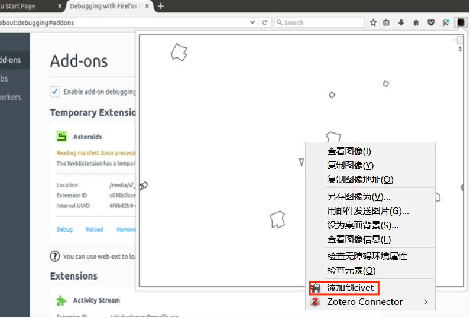

# image-steam

### 

### 安装
#### Chrome  
1. 下载`image-steam-for-chrome.crx`, 然后解压到本地。  
2. 在浏览器输入: `chrome://extensions/`，选择`开发者模式`，然后选择`加载已解压的扩展程序`, 选择刚才解压的文件夹。完成安装。
3. 之后您也可以在浏览器右上角扩展中固定`image-steam`，做一些设置  
4. 不要拖拽安装，因为没钱向谷歌交开发费  
#### Firefox  
可以通过火狐浏览器进行安装：  
[https://addons.mozilla.org/zh-CN/firefox/addon/image-steam/](https://addons.mozilla.org/zh-CN/firefox/addon/image-steam/)

### 使用
右键你要保存的图片 -> 选择`保存到civet`  
### 下载  
[下载链接](https://github.com/webbery/image-steam/releases)
